# CS307 - Assignment 3
### Group 10  
* Priyansh Saxena (_B14118_)
* Sahil Arora (_B14128_)
* Sumant Garg (_B14134_)
* Shruti Garg (_B13138_)  
---

### Nagios Overview
Nagios, now known as Nagios Core, is a free and open source computer-software application that monitors systems, networks and infrastructure. Nagios offers monitoring and alerting services for servers, switches, applications and services. It alerts users when things go wrong and alerts them a second time when the problem has been resolved. Currently it provides the following services:

* Monitoring of network services (SMTP, POP3, HTTP, NNTP, ICMP, SNMP, FTP, SSH).
* Monitoring of host resources (processor load, disk usage, system logs) on a majority of network operating systems, including Microsoft Windows, using monitoring agents.
---

### What is SNMP ?
* Simple Network Management Protocol (SNMP) is a popular protocol for network management. 
* It is used for collecting information from, and configuring, network devices, such as servers, printers, hubs, switches, and routers on an Internet Protocol (IP) network.
---

### How to identify units of measurement from SNMP ?
* To get the metric-descriptor of storage-units on `students.iitmandi.ac.in`, issue the following command:
    ```
    snmpwalk -v 1 -c public 10.8.1.3 .1.3.6.1.2.1.25.2.3.1.3
    ``` 
* Next, get the custom-multiplier for a metric (say, `Physical Memory`) by issuing the following command:
    ```
    snmpwalk -v1 -c public 10.8.1.3 .1.3.6.1.2.1.25.2.3.1.4.1
    ```
* Replace the `1` at the end of the previous command with the appropriate metric-descriptor to get custom-multipliers for that metric. 
---

### Services Monitored
* Ping-Time (Round Trip Average in miiliseconds)
* RAM Used (in kB)
* CPU Load (fractional usage)
* User Load (number of users)
---

### Time-slots used for data-collection
* Thursday-Friday - 20:00 - 02:00
* Friday-Saturday -  20:00 - 02:00
* Sunday-Monday -  20:00 - 02:00
---

### General Observations 
* SNMP is not installed on webopac.iitmandi.ac.in. This shows the following message on RAM Used and User Load in Nagios Dashboard:
    ```
    CRITICAL - Plugin timed out while executing system call 
    ```
* User Load and CPU Load show similar trends. This indicates that user-based services are more prominent on all the servers.
* Packets lost show trends similar to ping-times, denoting network-congestion at times when packets are lost in significant amount.
* Packet-losses are almost zero for almost the whole day. Week-long average is 1% for all the servers.
* On Sunday, due to power-failure in G2 building from 20:00 to 21:30, the graph is fairly constant because of missing values and therefore extrapolation. Also, the ping-times are considerably higher.

### insite.iitmandi.ac.in
* RAM Usage of insite unusually increases to around thrice its value in the morning, starting at aroung 7:30 am and continues to remain high for 3-4 hours at a stretch. This may be attributed to some periodic tasks scheduled to run at this time. It was quite low from 18:00 to 6:00 on weekends, owing to people being engaged by Exodia.
* Ping time is higher than average during evening-hours, from 18:00 to 00:00. This is because insite usage is quite less during class-hours and high during evenings.
* High ping-time durations closely correspond to high packet-loss durations. Those periods denote network-congestion.
* User Load goes slightly up after 22:00, and remains a little less from 20:00 to 22:00. This corresponds to the dinner-times.

### students.iitmandi.ac.in
* User Load, and correspondingly CPU Load is low during early-morning hours, from 04:00 to 06:00. This is the time when maximum number of students sleep. 
* CPU load is higher than usual from 12:00 - 02:00 and 06:30 - 08:00 on all days. The first duration can be explained by people using their smart-phones after some deadline or completion of events during weekends, thereby enabling wi-fi and synchronising their e-mail clients. Everyone turns off wi-fi in their smart-phones at night, so the morning-peak may occur because of a similar reason. This also explains the short-peaks at around lunch-time, 12:00 - 14:00.
* RAM Usage is higher on Saturday and Sunday, whereas User Load and CPU Load is higher on Friday.
* Packet losses are quite less, 14% at the max.

### network.iitmandi.ac.in
* Generally, CPU load hikes at some intervals every day
* RAM usage is constant throughout the day on weekends, at a value of around 5.0GB. However, the usage increases to about 6.0GB on Sunday and Monday, corresponding to return to normal routine from fest-time. This is because the services running on this server (like Nagios) are constantly working, and are affected much less by external factors.
* RAM usage increases slightly over the weekend, as more users start monitoring this server using Nagios.
* Ping is high in the evening on Friday and very low in the morning, because of the schedule of Exodia on Friday and no-instruction-day. There is a sharp peak after 16:30 in ping-time, user-load and CPU-load.
* CPU-load and User-load are very low from 18:30 to 00:00 on Saturday, due to students being present in Exodia.
* User-load is low, and probably this value reflects the number of testers using Nagios to monitor it.

### webopac.iitmandi.ac.in
* There is heavy packet-loss for WebOPAC as compared to other servers.
* Ping-times are higher than any other server.
* Due to unavailability of SNMP on this server, there is no data for CPU Load, User Load and RAM Used.

### Graphs
 * #### Day 1: Thursday
    * ##### students.iitmandi.ac.in
    |               |             |
    | ------------- |:-------------:|
    | 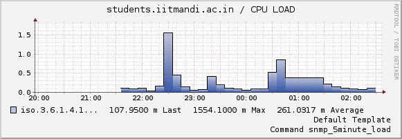| 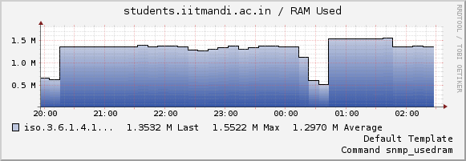 |
    | 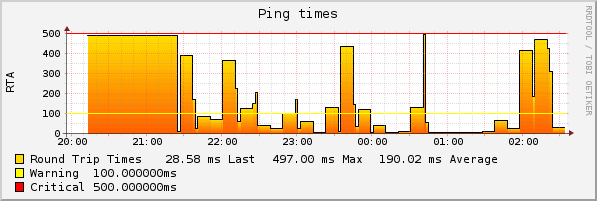| 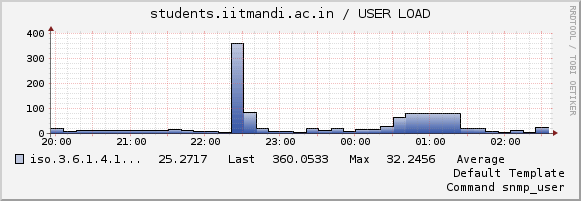 |

    * ##### insite.iitmandi.ac.in
    |               |             |
    | ------------- |:-------------:|
    | 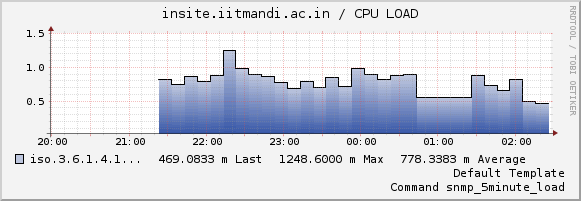| 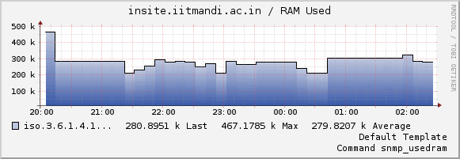 |
    | 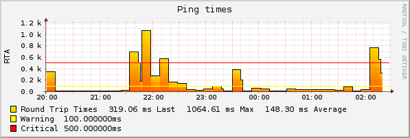| 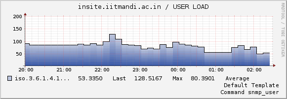 |

    * ##### network.iitmandi.ac.in
    |               |             |
    | ------------- |:-------------:|
    | 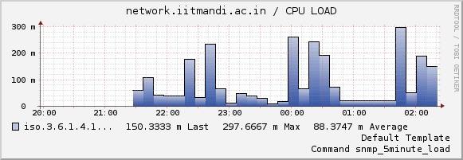| 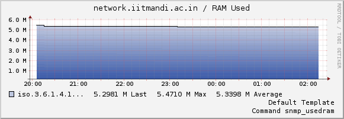 |
    | 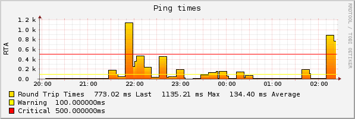| 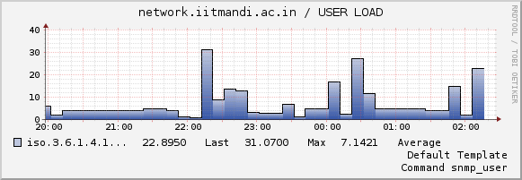 |

    * ##### webopac.iitmandi.ac.in
    |               |             |
    | ------------- |:-------------:|
    | 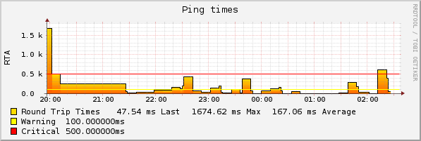| 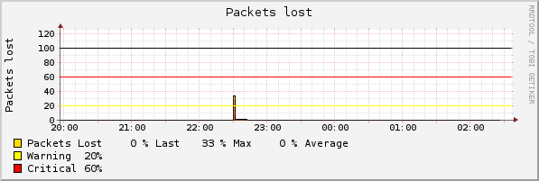|

 * #### Day 2: Friday
    * ##### students.iitmandi.ac.in
    |               |             |
    | ------------- |:-------------:|
    | 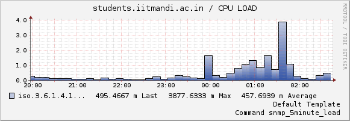| 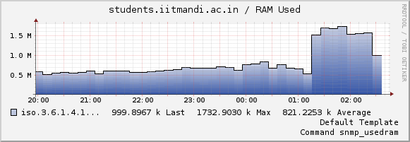 |
    | 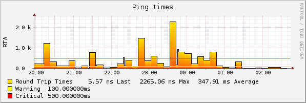| 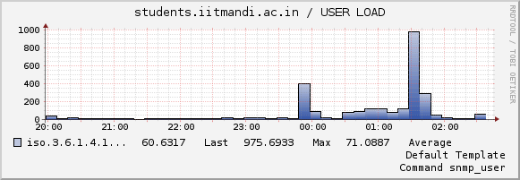 |

    * ##### insite.iitmandi.ac.in
    |               |             |
    | ------------- |:-------------:|
    | 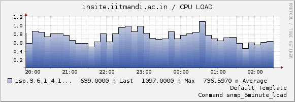| 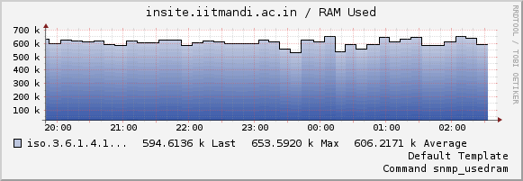 |
    | 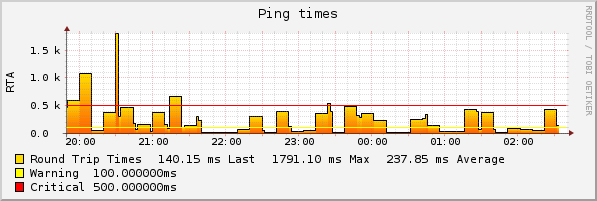| 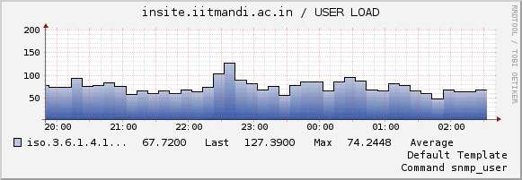 |

    * ##### network.iitmandi.ac.in
    |               |             |
    | ------------- |:-------------:|
    | 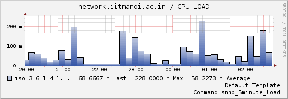| 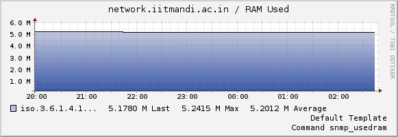 |
    | 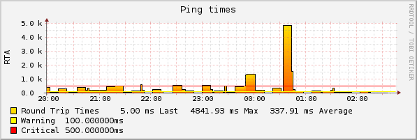| 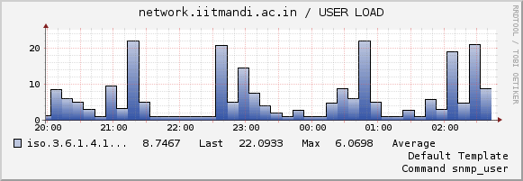 |

    * ##### webopac.iitmandi.ac.in
    |               |             |
    | ------------- |:-------------:|
    | 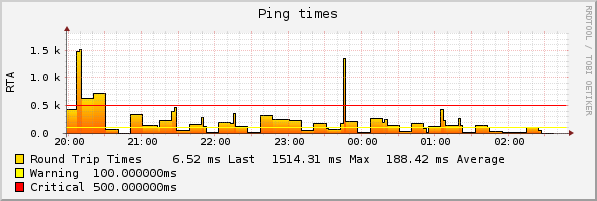| 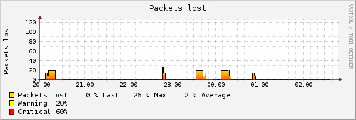|

* #### Day 3: Sunday
    * ##### students.iitmandi.ac.in
    |               |             |
    | ------------- |:-------------:|
    | 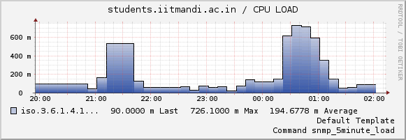| 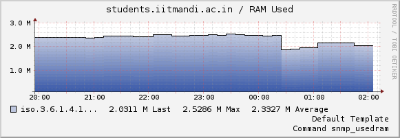 |
    | 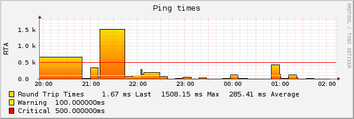| 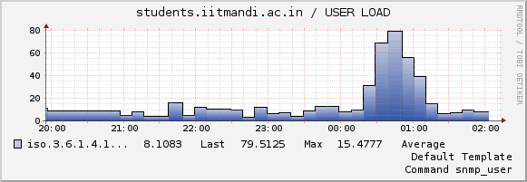 |

    * ##### insite.iitmandi.ac.in
    |               |             |
    | ------------- |:-------------:|
    | 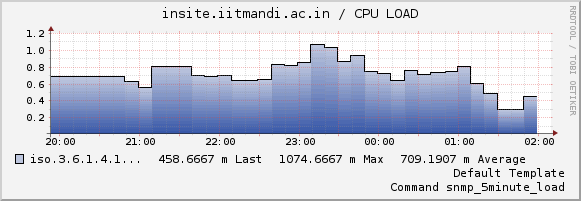| 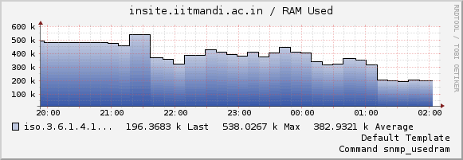 |
    | 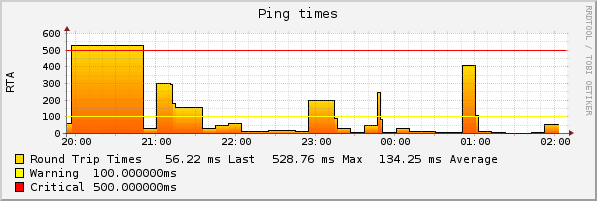| 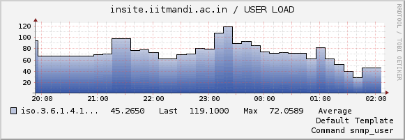 |

    * ##### network.iitmandi.ac.in
    |               |             |
    | ------------- |:-------------:|
    | 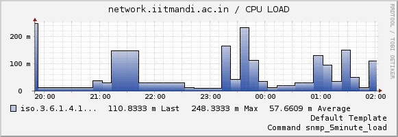| 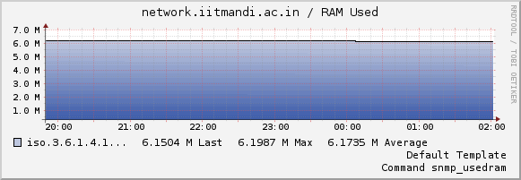 |
    | 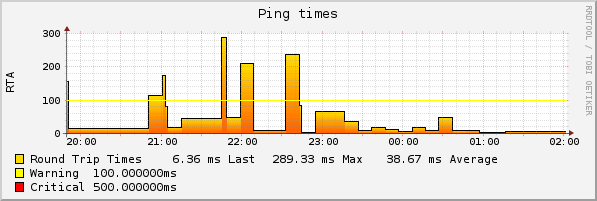| 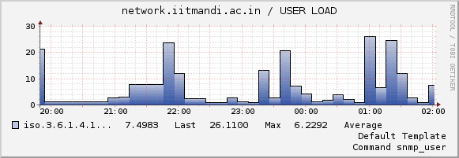 |

    * ##### webopac.iitmandi.ac.in
    |               |             |
    | ------------- |:-------------:|
    | 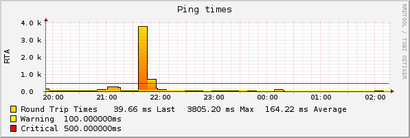| 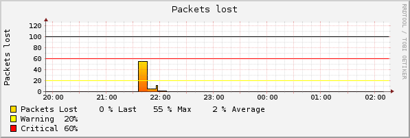|

---

### NRPE Script Run

The machine that is used for calling the script is referred to as master (`10.8.17.141`) while the one that runs the script is called slave (`10.8.15.131`).

Following steps were taken to run script by master that is present on slave machine, using NRPE Plugin:
  * The script is put in /usr/local/nagios/libexec in the slave machine. Let the script be `test.sh`.
  * In the slave machine, we edit the  /usr/local/nagios/etc/nrpe.cfg file and include a command for running `test.sh` by adding the following line:  
    ```
    command[testScript]=/usr/local/nagios/libexec/test.sh
    ```
  * Edit the file `/etc/xinetd.d/nrpe`. The `only_from` line should look like:
    ```
    only_from       = 127.0.0.1 10.8.17.141
    ```
  * Edit the file `/etc/nagios/nrpe.cfg`:
    * Add the IP Address of the master to `allowed_hosts`, comma-separated list.
    * Add the following line to add the new command:  
    ```
    command[testScript]=/usr/local/nagios/libexec/test.sh
    ```  
  * Restart nagios-nrpe-server in the slave:  
    ```
    sudo service nagios-nrpe-server restart
    ```
  * In master machine, edit the `/usr/local/nagios/etc/objects/commands.cfg` to include the following command:
    ```
    define command {
        command_name check_nrpe
        command_line $USER1$/check_nrpe -H $HOSTADDRESS$ -c $ARG1$
    }
    ```
  * The script can now be run by the following command:   
    ```
    /usr/local/nagios/libexec/check_nrpe -H 10.8.15.131 -c testScript
    ```

### References
  * [Nagios](https://en.wikipedia.org/wiki/Nagios)
  * [What is SNMP ?](https://technet.microsoft.com/en-us/library/cc776379(v=ws.10).aspx)
  * [Monitoring Linux via SNMP](https://www.zabbix.com/forum/archive/index.php/t-19754.html)
  * [Execute remote script with NRPE](http://stackoverflow.com/questions/27313780/execute-remote-script-with-nrpe)